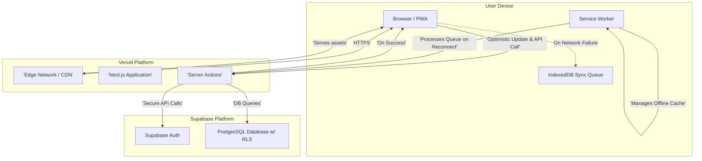

# Lima Planner Fullstack Architecture Document (v1.3)

### Introduction

This document outlines the complete fullstack architecture for **Lima Planner**. It serves as the single source of truth for AI-driven development, ensuring consistency across the entire technology stack.

---

#### Starter Template or Existing Project

The project will be a **greenfield application**. To accelerate setup and enforce best practices, we will use the official **Nx `next` preset (`@nx/next`)**. This will generate an integrated monorepo with a Next.js application, pre-configured with modern tooling like **Vitest** for testing and ESLint for code quality.

---

#### Change Log

| Date       | Version | Description                                                                       | Author              |
| :--------- | :------ | :-------------------------------------------------------------------------------- | :------------------ |
| 2025-09-17 | 1.3     | Refined Git workflow with `develop` branch and separate staging/prod deployments. | Winston (architect) |
| 2025-09-17 | 1.2     | Added detailed Git workflow, CI/CD, and SOLID coding standards.                   | Winston (architect) |
| 2025-09-17 | 1.1     | Updated tech stack, offline strategy, and folder structure per user feedback.     | Winston (architect) |
| 2025-09-17 | 1.0     | Initial full-stack architecture draft                                             | Winston (architect) |

---

### High-Level Architecture

#### Technical Summary

Lima Planner's architecture is a modern, **Progressive Web App (PWA)** with an **optimistic UI and offline fallback**, built within an **Nx monorepo**. The frontend is a server-side rendered (SSR) **Next.js** application hosted on **Vercel**, with backend logic handled by **Next.js Server Actions**. On the client, an **optimistic UI** provides instant feedback, while **IndexedDB** is used to queue changes made during offline periods. This architecture is designed to be highly performant, secure, and scalable while directly supporting the product's core goals of providing a calm, focused, and always-available user experience.

---

#### High-Level Architecture Diagram



---

#### Architectural Patterns

- **Optimistic UI with Offline Fallback:** When online, the UI updates instantly while simultaneously sending requests to the server. If a request fails, the UI change is reverted. When the application detects it is offline, all data mutations are queued in IndexedDB. The queue is automatically processed and synced with the backend upon reconnection.
- **Serverless (via Server Actions):** All backend logic is encapsulated in Next.js Server Actions. This creates a secure boundary where the Supabase client with service-level keys is never exposed to the browser.
- **Repository Pattern:** A dedicated `domain` package will abstract all data access logic and include mappers to translate data between the database's `snake_case` format and the application's `camelCase` format.
- **Feature-Based Structure:** Inside the Next.js application, code will be organized by feature (e.g., tasks, projects, auth) rather than by type (e.g., components, hooks, pages). This improves modularity and makes the codebase easier to navigate and maintain.

---

### Tech Stack

| Category                  | Technology       | Version | Purpose                        | Rationale                                                                             |
| :------------------------ | :--------------- | :------ | :----------------------------- | :------------------------------------------------------------------------------------ |
| **Monorepo Tool**         | Nx               | latest  | Manage the full-stack monorepo | Required by PRD for code sharing and build efficiency.                                |
| **Frontend Framework**    | Next.js          | latest  | Primary web framework          | Required by PRD; provides SSR, Server Actions, and a great DX.                        |
| **UI Component Library**  | Mantine          | latest  | Foundation for UI components   | Chosen in UI/UX spec for its accessibility and themeability.                          |
| **State Management**      | Zustand          | latest  | Global client-side state       | Lightweight, simple, and avoids boilerplate for managing global state.                |
| **Client-side DB**        | Dexie.js         | latest  | IndexedDB Wrapper              | Simplifies IndexedDB operations for the offline sync queue.                           |
| **Backend & Auth**        | Supabase         | latest  | BaaS (Database, Auth)          | Required by PRD for its integrated Postgres DB and secure auth.                       |
| **API Style**             | Server Actions   | N/A     | Secure backend logic           | Required by PRD; eliminates the need for traditional API routes.                      |
| **Unit/Integration Test** | **Vitest** / RTL | latest  | Component & logic testing      | Modern, fast, and Jest-compatible test runner.                                        |
| **E2E Testing**           | Playwright       | latest  | End-to-end user flow testing   | Required by PRD for critical path testing.                                            |
| **Styling**               | Mantine CSS      | N/A     | Styling solution               | Tightly integrated with the Mantine component library for a consistent design system. |

---

### Data Models

The following `camelCase` TypeScript interfaces will be defined in `packages/types`.

#### Project

```typescript
// packages/types/src/project.ts
export interface Project {
  id: string;
  userId: string;
  name: string;
  color: string;
  createdAt: string;
}
```

---

#### Note

```typescript
// packages/types/src/note.ts
export interface Note {
  id: string;
  userId: string;
  title: string;
  content: string;
  createdAt: string;
  updatedAt: string;
}
```

---

#### Task

```typescript
// packages/types/src/task.ts
export type TaskPriority = "High" | "Medium" | "Low";
export type TaskStatus = "Pending" | "Completed";

export interface Task {
  id: string;
  userId: string;
  projectId?: string | null;
  noteIds?: string[] | null;
  content: string;
  priority: TaskPriority;
  status: TaskStatus;
  dueDate: string;
  displayOrder: number;
  createdAt: string;
}
```

---

### Unified Project Structure

```plaintext
lima-planner/
├── .github/
│   └── workflows/          # GitHub Actions CI/CD pipelines
│       ├── ci.yml          # Runs on PRs to develop
│       ├── deploy-staging.yml # Runs on merge to develop
│       └── deploy-prod.yml # Manually triggered on main
├── apps/
│   ├── lima-web/
│   │   └── src/
│   │       ├── app/              # Root layouts, pages, API routes
│   │       ├── features/         # Feature-based modules
│   │       │   ├── auth/
│   │       │   │   ├── components/
│   │       │   │   └── actions.ts
│   │       │   ├── tasks/
│   │       │   │   ├── components/ # e.g., TaskCard.tsx, TaskForm.tsx
│   │       │   │   ├── hooks/      # e.g., useTasks.ts
│   │       │   │   └── actions.ts  # Server Actions for tasks
│   │       │   └── ...             # Other features (projects, notes)
│   │       ├── lib/                # Core libraries (Supabase client, sync service)
│   │       └── styles/             # Global styles
│   └── lima-web-e2e/
├── packages/
│   ├── domain/               # Data access logic and mappers
│   ├── ui/                   # Shared, generic UI components
│   └── types/                # Shared TypeScript interfaces
└── package.json            # Root package.json with app version
```

---

### Source Control & CI/CD Workflow

#### Branching Strategy

- **`main`**: This branch is a mirror of the current **production code**. Direct commits are forbidden.
- **`develop`**: This is the primary integration branch containing the **latest development code**. All feature branches are created from `develop`.
- **Feature Branches (`feat/...`, `fix/...`, etc.)**: All new work must be done on a feature branch. When complete, a Pull Request is opened to merge the feature branch into `develop`.

---

#### Commit Conventions

- All commit messages **must** follow the **Conventional Commits** specification (e.g., `feat(tasks): ...`, `fix(auth): ...`). This is essential for automated versioning.
- This will be enforced automatically using Git hooks.

---

#### Git Hooks

- **`husky`** and **`commitlint`** will be configured to run a `commit-msg` hook, which will validate that every commit message adheres to the Conventional Commits format before it can be created.

---

#### Continuous Integration (CI)

- A **GitHub Actions** workflow (`ci.yml`) will run on every Pull Request targeting the `develop` branch.
- The CI pipeline will execute linting, testing, and build jobs. A PR cannot be merged into `develop` until all checks pass.

---

#### Staging Deployment & Versioning

- Upon a successful merge to `develop`, a **GitHub Actions** workflow (`deploy-staging.yml`) will trigger.
- This workflow has two key responsibilities:
  1.  **Semantic Versioning:** It will analyze the commit messages since the last release and automatically bump the `version` in the root `package.json` (patch, minor, or major). It will then commit this change back to `develop`.
  2.  **Staging Deployment:** It will deploy the application to a **staging environment** on Vercel for final review and QA.

---

#### Production Deployment

- **Release Process:** When the `develop` branch is stable and ready for production, a Pull Request is opened from `develop` to `main`.
- **Manual Trigger:** After the release PR is merged into `main`, the production deployment is **manually triggered**.
- **Production Workflow (`deploy-prod.yml`):**
  1.  A project manager or lead developer manually runs the "Deploy to Production" action in GitHub.
  2.  The workflow deploys the `main` branch to the **production environment** on Vercel.
  3.  Upon successful deployment, it automatically creates a Git tag (e.g., `v1.2.0`) from the version in `package.json`, marking the release point.

---

### Development Workflow

#### Local Development Setup

1.  **Prerequisites:** Node.js v20+, **npm**, Docker (for local Supabase).
2.  **Installation:** Run `npm install` in the root directory.
3.  **Local Backend:** Run `npx supabase start`.
4.  **Run App:** Run `npx nx serve lima-web`.

---

### Coding Standards

- **SOLID Component Design:** Components should adhere to the Single Responsibility Principle. They should be focused on one piece of functionality and compose with other components to build complex UIs.
- **Automated Formatting:** **ESLint** and **Prettier** will be configured at the monorepo root to enforce a consistent coding style. A pre-commit hook will automatically format staged files.
- **Function Commenting:** All non-trivial, reusable functions, especially those in the `domain` and `lib` packages, **must** be documented with JSDoc-style comments explaining their purpose, parameters, and return values.
- **Database \<\> App Mapping:** The `domain` package **must** contain data mapper functions to translate between the database's `snake_case` and the application's `camelCase` conventions.
- **Server-Side Logic:** All database interactions **must** occur within Next.js Server Actions.

<!-- end list -->
