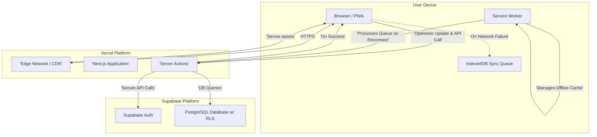

### High-Level Architecture

#### Technical Summary

Lima Planner's architecture is a modern, **Progressive Web App (PWA)** with an **optimistic UI and offline fallback**, built within an **Nx monorepo**. The frontend is a server-side rendered (SSR) **Next.js** application hosted on **Vercel**, with backend logic handled by **Next.js Server Actions**. On the client, an **optimistic UI** provides instant feedback, while **IndexedDB** is used to queue changes made during offline periods. This architecture is designed to be highly performant, secure, and scalable while directly supporting the product's core goals of providing a calm, focused, and always-available user experience.

***

#### High-Level Architecture Diagram

***

#### Architectural Patterns

* **Optimistic UI with Offline Fallback:** When online, the UI updates instantly while simultaneously sending requests to the server. If a request fails, the UI change is reverted. When the application detects it is offline, all data mutations are queued in IndexedDB. The queue is automatically processed and synced with the backend upon reconnection.
* **Serverless (via Server Actions):** All backend logic is encapsulated in Next.js Server Actions. This creates a secure boundary where the Supabase client with service-level keys is never exposed to the browser.
* **Repository Pattern:** A dedicated `domain` package will abstract all data access logic and include mappers to translate data between the database's `snake_case` format and the application's `camelCase` format.
* **Feature-Based Structure:** Inside the Next.js application, code will be organized by feature (e.g., tasks, projects, auth) rather than by type (e.g., components, hooks, pages). This improves modularity and makes the codebase easier to navigate and maintain.

***
