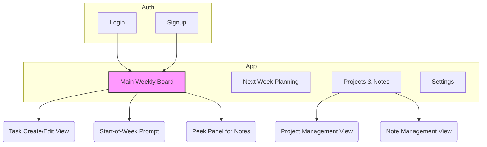
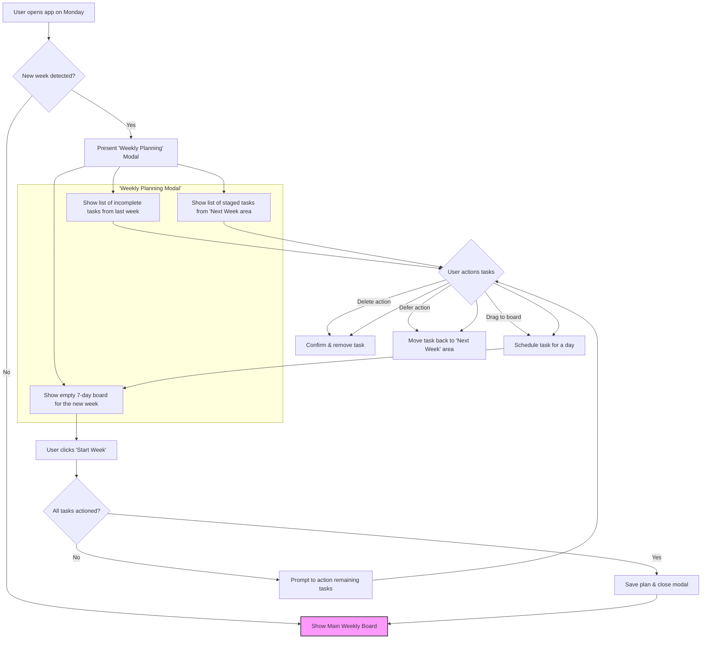
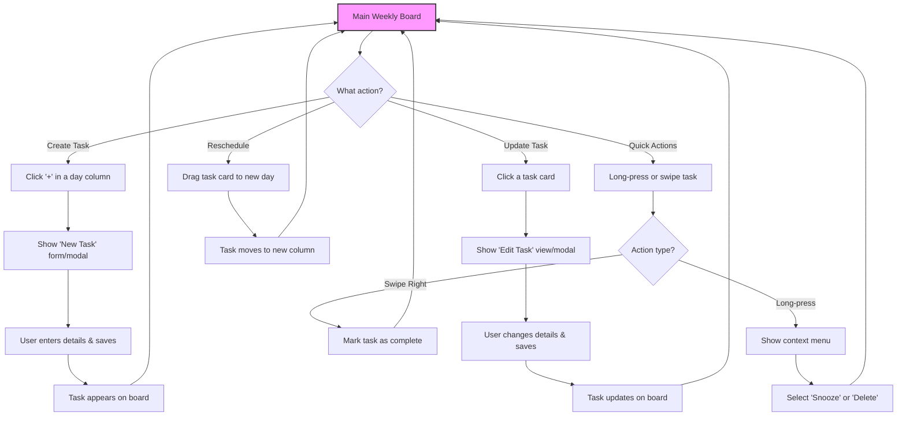

# Lima Planner UI/UX Specification

---

### Introduction

This document defines the user experience goals, information architecture, user flows, and visual design specifications for the Lima Planner's user interface. It serves as the foundation for visual design and frontend development, ensuring a cohesive and user-centered experience.

| Date       | Version | Description                       | Author            |
| :--------- | :------ | :-------------------------------- | :---------------- |
| 2025-09-17 | 1.0     | Initial UI/UX Specification draft | Sally (ux-expert) |

---

#### Overall UX Goals & Principles (v1.1)

**Target User Personas**

- **The Focused Professional:** A modern professional who is organized but feels overwhelmed by the constant noise of traditional task managers. They value calm, clarity, and a clear boundary between planning and execution. Their goal is to end the week feeling accomplished, not just busy.

**Usability Goals**

- **Clarity:** The interface must be immediately understandable, with a minimal learning curve.
- **Focus:** The design must actively protect the user's attention on their current week's tasks, minimizing distractions from future planning.
- **Efficiency:** Common actions like completing, rescheduling, and snoozing tasks must be achievable with minimal effort, especially on mobile devices.
- **Confidence:** The offline-first nature must be seamless, giving the user confidence that their data is always saved and available.
- **Adaptable Interface:** The UI should offer both light and dark modes with a pleasant, pastel-based color palette to suit user preference and environment.

**Design Principles**

1.  **Clarity Over Cleverness:** Prioritize clear communication and intuitive interactions over novel but potentially confusing design patterns.
2.  **Protect the Focus:** The UI must enforce a clear separation between the "execution space" (This Week) and the "planning space" (Next Week).
3.  **Mobile First, Always:** Every design decision must begin with the mobile experience and scale up gracefully to larger screens.
4.  **Graceful Scaling:** While mobile-first, the experience must adapt thoughtfully to larger screens, fully utilizing the available space on desktop to enhance productivity without adding clutter.
5.  **Provide a Sense of Calm:** Use minimalist aesthetics, generous whitespace, and a clear hierarchy to reduce cognitive load and create a calming user experience.
6.  **Accessible by Default:** Ensure the application is usable by everyone by adhering to WCAG 2.1 AA standards from the outset.

---

### Section 2: Information Architecture (IA)

This structure organizes the application's content logically, making it easy for users to navigate and find what they need.

#### Site Map / Screen Inventory

This diagram shows the relationship between all the primary screens in the application.

#### Navigation Structure

- **Primary Navigation:** A simple, persistent navigation bar (likely at the bottom on mobile and top/side on desktop) will provide access to the main views:
  - This Week (Main Weekly Board)
  - Next Week
  - Projects & Notes
  - Settings / Account
- **Contextual Navigation:** Actions like creating or editing a task will occur in modals or dedicated sub-views to maintain the user's context on the main board.
- **Breadcrumb Strategy:** Not required for MVP, as the application has a relatively flat architecture. Navigation will be clear through the primary controls.

---

### Section 3: User Flows

#### Flow 1: Weekly Planning & Carryover

- **User Goal:** To start a new week with a clean, intentional plan by processing unfinished tasks from the previous week and planned tasks for the new week.
- **Entry Points:** The user opens the application for the first time on or after the designated start of the new week (e.g., Monday morning).
- **Success Criteria:** The user's new weekly board is populated with their chosen tasks, and all incomplete and staged tasks have been actioned (scheduled, deleted, or deferred).

**Flow Diagram**

**Edge Cases & Error Handling:**

- **No tasks to plan:** If there are no incomplete tasks and no tasks staged for the "Next Week", the modal can be skipped, taking the user directly to their fresh, empty weekly board.
- **User closes app mid-planning:** The planning state should be saved, so when the user re-opens the app, they can resume where they left off.
- **Sync conflicts:** If data has changed on another device since the user last synced, the planning view should use the most up-to-date information, potentially notifying the user of any new tasks that need to be planned.

#### Flow 2: Daily Task Management

- **User Goal:** To create, update, complete, and reschedule tasks efficiently throughout the week to keep their plan up-to-date.
- **Entry Points:** The user is viewing their Main Weekly Board.
- **Success Criteria:** The user can perform all core task actions (CRUD, complete, reorder, reschedule, snooze) intuitively and quickly, with the UI providing immediate, optimistic feedback.

**Flow Diagram**

**Interaction Notes:**

- **Creating Tasks:** The `+` button in each day's column header is the primary entry point for adding a new task, pre-filling the date for that day.
- **Quick Complete:** A right swipe is a common, satisfying gesture for completing an item and should be the fastest way to mark a task as done.
- **Context Menu:** A long-press reveals less common but still important actions like "Snooze to Weekend," "Snooze to Next Week," and "Delete," keeping the main UI clean.
- **Optimistic Updates:** All actions (creating, moving, completing) should feel instantaneous on the UI, with background processes handling the actual data synchronization.

---

### Section 4: Wireframes & Mockups

- **Primary Design Files:** [Link to Figma/Sketch/XD Project - TBD]

#### Key Screen Layout: Main Weekly Board

**Mobile View (Mobile-First)**

- **Header:** A sticky header will display the current day and date (e.g., "Today: Wednesday, Sep 17").
- **Main Board:** A horizontally scrolling Kanban-style view with seven columns, one for each day of the week. The current day's column will be visually highlighted.
- **Task Cards:** Clean, simple cards displaying the task content and a visual priority indicator.
- **Navigation:** A bottom navigation bar provides persistent access to the app's main sections.

**Desktop View (Utilizing Space)**

- **Layout:** A two-column layout.
- **Left Sidebar (Navigation):** The primary navigation moves to a dedicated sidebar.
- **Center Column (Main Board):** The 7-day Kanban board is displayed in full without horizontal scrolling.

---

### Section 5: Component Library / Design System (v1.1)

- **Design System Approach:** We will build a customized design system on top of the **Mantine component library**. Mantine provides a comprehensive set of accessible, themeable, and responsive components that will serve as our foundation. Our work in the `ui` package will focus on creating a custom Mantine theme and building project-specific, composite components.

#### Core Composite Components (Built with Mantine)

- **AppShell:**
  - **Purpose:** To manage the application's responsive layout.
  - **Mantine Components:** Will use `Mantine.AppShell` to configure the sticky header, bottom navigation for mobile, and sidebars for the desktop view.
- **TaskCard:**
  - **Purpose:** To represent a single task on the weekly board.
  - **Mantine Components:** A composite component built using `Mantine.Card`, `Text`, and our custom `PriorityBadge`.
- **DayColumn:**
  - **Purpose:** To act as a container for all tasks scheduled for a specific day.
  - **Mantine Components:** Will use `Mantine.Stack` and `Mantine.Paper` for structure and styling.
- **TaskForm:**
  - **Purpose:** The form for creating and editing tasks.
  - **Mantine Components:** Will utilize `Mantine.Modal`, `TextInput`, `Select` (for priority), and `Button` components.
- **PriorityBadge:**
  - **Purpose:** A visual indicator for task priority.
  - **Mantine Components:** A customized `Mantine.Badge` component, styled according to our color scheme.

---

### Section 6: Branding & Style Guide

#### Visual Identity

- **Brand Guidelines:** The aesthetic is minimalist, calm, and focus-oriented. The design will use a soft, pastel-based color palette to be easy on the eyes.
- **Theme Support:** The UI **must** support both **Light** and **Dark** modes.

#### Color Palette (v1.1)

| Color Type    | Light Mode    | Dark Mode     | Usage                                                                                                       |
| :------------ | :------------ | :------------ | :---------------------------------------------------------------------------------------------------------- |
| **Primary**   | **Dark Blue** | **Dark Blue** | **Primary interactive elements, buttons, links. Must meet AA contrast on both light and dark backgrounds.** |
| Accent        | Gentle Teal   | Dusty Teal    | "Today" highlight, focus indicators                                                                         |
| High Priority | Warm Peach    | Muted Coral   | High-priority task indicator                                                                                |
| Med Priority  | Soft Lilac    | Dusty Lilac   | Medium-priority task indicator                                                                              |
| Low Priority  | Pale Mint     | Muted Sage    | Low-priority task indicator                                                                                 |
| Background    | Off-White     | Dark Slate    | Main app background                                                                                         |
| Surface       | White         | Dark Grey     | Card and modal backgrounds                                                                                  |
| Text          | Charcoal      | Light Grey    | Body copy and headings                                                                                      |
| Error         | Soft Red      | Muted Red     | Validation errors, destructive actions                                                                      |

#### Typography

- **Font Families:** We will use a clean, sans-serif font like **Inter** for all UI text to maximize readability.
- **Type Scale:** The Mantine theme will define a responsive type scale for headings (H1, H2, H3) and body text.

#### Spacing & Layout

- **Grid System:** We will use Mantine's built-in grid and spacing system (`theme.spacing`).

---

### Section 7: Accessibility Requirements

- **Compliance Target:** Web Content Accessibility Guidelines (WCAG) 2.1 Level AA.

#### Key Requirements

**Visual:**

- **Color Contrast:** All text and interactive elements must have a contrast ratio of at least 4.5:1 against their background.
- **Focus Indicators:** All interactive elements must have a clear and visible focus state.
- **Text Sizing:** Users must be able to resize text up to 200% without loss of content or functionality.

**Interaction:**

- **Keyboard Navigation:** All functionality must be operable through a keyboard interface.
- **Screen Reader Support:** The application must be compatible with modern screen readers, using semantic HTML and ARIA roles.
- **Touch Targets:** All touch targets on mobile must be large enough to be easily tapped.

**Content:**

- **Alternative Text:** All meaningful images must have descriptive alternative text.
- **Heading Structure:** The application must use a logical and semantic heading structure.
- **Form Labels:** All form inputs must have clearly associated and descriptive labels.

#### Testing Strategy

Accessibility will be tested through a combination of automated tools (like Axe), manual keyboard navigation checks, and testing with screen readers.

---

### Section 8: Responsiveness Strategy

#### Breakpoints

| Breakpoint   | Min Width | Target Devices                        |
| :----------- | :-------- | :------------------------------------ |
| Mobile (xs)  | 320px     | Small to large mobile phones          |
| Tablet (sm)  | 768px     | Tablets in portrait and landscape     |
| Desktop (md) | 1024px    | Laptops and standard desktop monitors |
| Wide (lg)    | 1440px    | Large and ultrawide monitors          |

#### Adaptation Patterns

- **Layout Changes:** The layout will fluidly adapt from a single-column on mobile to the three-column layout on desktop.
- **Navigation Changes:** The primary navigation will transform from a bottom tab bar on mobile to a full-height sidebar on desktop.
- **Content Priority:** The core content—the 7-day Kanban board—will transition from a horizontal scroll on mobile to a fully visible grid on desktop.
- **Interaction Changes:** Hover-based interactions will be introduced on desktop, while the mobile experience will prioritize touch-based gestures.

---

### Section 9: Animation & Micro-interactions

#### Motion Principles

- **Purposeful:** Every animation should have a clear purpose, such as providing feedback or guiding the user's attention.
- **Fluid & Responsive:** Animations should be fast and interruptible, making the UI feel responsive.
- **Subtle:** We will avoid jarring or overly complex animations to maintain a calm user experience.

#### Key Animations & Micro-interactions

- **Task Drag & Drop:** A gentle lift and smooth animation.
- **Task Completion:** A satisfying but quick fade and strike-through effect.
- **Modal & Panel Transitions:** A subtle, quick fade and slide transition.
- **State Changes:** Smooth, brief transitions for toggles and priority changes.

---

### Section 10: Performance Considerations

#### Performance Goals

- **Page Load:** Aim for a Largest Contentful Paint (LCP) of under 2.5 seconds.
- **Interaction Response:** All user interactions should provide feedback in under 100ms.
- **Animation FPS:** All animations and scrolling must maintain a consistent 60 frames per second (FPS).

#### Design Strategies

- **Optimistic UI Updates:** Update the UI immediately for all user actions.
- **Virtualization:** For long task lists, render only the visible tasks.
- **Lazy Loading:** Defer loading of non-critical views like "Settings".
- **Skeleton Screens:** Show simple placeholders while data is being fetched.

---

### Section 11: Next Steps

#### Immediate Actions

1.  **Finalize Visual Design:** Solidify the full color palette and typography scale in a shared design tool like Figma.
2.  **Create High-Fidelity Mockups:** Develop detailed mockups for the key screens based on this specification.
3.  **Handoff to Architecture:** This completed specification, along with the mockups, should be handed off to the Architect to create the detailed `front-end-architecture.md` document.

#### Design Handoff Checklist

- [x] All user flows documented
- [x] Component inventory complete
- [x] Accessibility requirements defined
- [x] Responsive strategy clear
- [x] Brand guidelines incorporated
- [x] Performance goals established

<!-- end list -->
